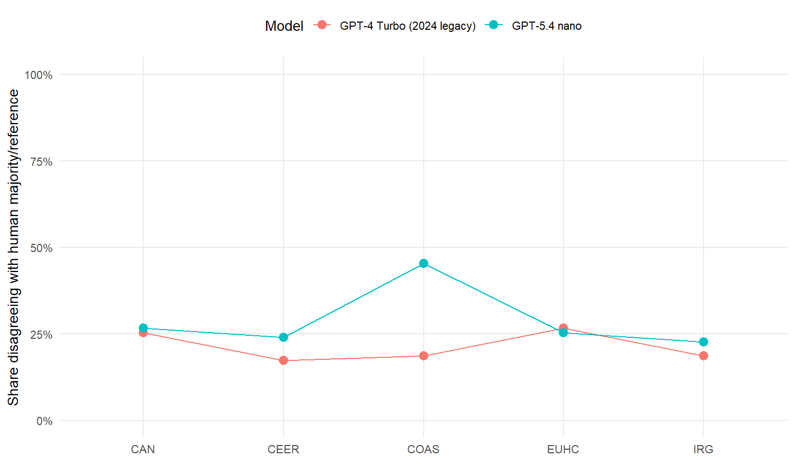
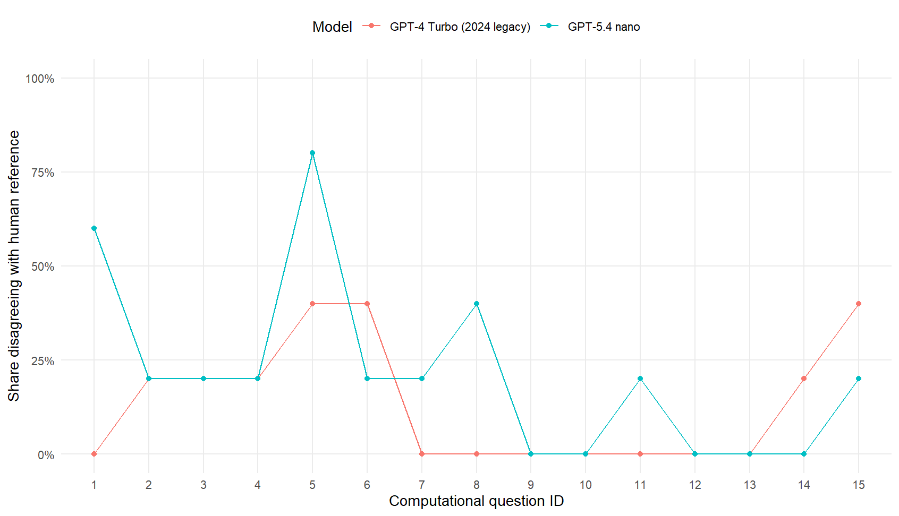

```{r}
#| label: setup
#| include: false
library(dplyr)
library(knitr)
library(readr)

paths <- list(
  overall = "derived/sbs_model_metrics_overall.csv",
  by_pon = "derived/sbs_model_metrics_by_pon.csv",
  stability = "derived/sbs_model_stability_overall.csv",
  coder = "derived/sbs_coder_comparison_extended.csv",
  diagnostics = "derived/sbs_output_format_diagnostics.csv"
)
comparison_ready <- all(file.exists(unlist(paths)))

if (comparison_ready) {
  overall <- readr::read_csv(paths$overall, show_col_types = FALSE)
  by_pon <- readr::read_csv(paths$by_pon, show_col_types = FALSE)
  stability <- readr::read_csv(paths$stability, show_col_types = FALSE)
  coder <- readr::read_csv(paths$coder, show_col_types = FALSE)
  diagnostics <- readr::read_csv(paths$diagnostics, show_col_types = FALSE)
}
```

## Design

This comparison changes **model generation only**. Both arms use the same reconstructed Dec. 24, 2024 SBS protocol and the same five PONs.

| Model | Status |
|---|---|
| GPT-4 Turbo | Frozen 2024 `*_sbs.txt` responses; never rerun |
| `gpt-5.4-nano-2026-03-17` | New SBS run under `output/current/` |

The improved-protocol experiment and plain-zero-shot outputs are archival/secondary and are not pooled into this analysis. The comparison pipeline considers only newer-model run directories containing `run_manifest.json` with `status == "complete"`; a directory carrying `run_failed.json`, or lacking an explicit completed manifest, is not treated as a completed result.

```{r}
#| label: no-results
#| results: asis
if (!comparison_ready) {
  cat("::: {.callout-important}\n")
  cat("## Newer-model SBS results are not complete yet\n\n")
  cat("Run the dry run, execute the five-request SBS batch, then rebuild derived products:\n\n")
  cat("```bash\n")
  cat("python scripts/03_run_current_model.py --model gpt-5.4-nano-2026-03-17\n")
  cat("python scripts/03_run_current_model.py --model gpt-5.4-nano-2026-03-17 --execute\n")
  cat("Rscript scripts/02_reconstruct_table_a5.R\n")
  cat("Rscript scripts/05_compare_scenarios.R\n")
  cat("quarto render\n")
  cat("```\n")
  cat(":::\n")
}
```

## Performance against the confirmed human reference

```{r}
#| label: tbl-overall
#| tbl-cap: "Overall SBS performance against the confirmed human reference"
if (comparison_ready) {
  overall |>
    dplyr::mutate(
      accuracy = scales::percent(.data$accuracy, accuracy = 0.1),
      disagreement_rate = scales::percent(.data$disagreement_rate, accuracy = 0.1),
      precision = scales::percent(.data$precision, accuracy = 0.1),
      recall = scales::percent(.data$recall, accuracy = 0.1),
      specificity = scales::percent(.data$specificity, accuracy = 0.1),
      f1 = scales::percent(.data$f1, accuracy = 0.1)
    ) |>
    knitr::kable()
}
```

```{r}
#| label: fig-by-pon
#| fig-cap: "Share of SBS decisions disagreeing with the confirmed human reference by PON."
#| results: asis
if (comparison_ready) cat("\n")
```

## Agreement with the human majority

The extended coder table keeps HBM, ASC, and JNG visible and computes the human majority directly. It then reports whether each LLM agrees with that majority.

```{r}
#| label: tbl-majority
#| tbl-cap: "LLM agreement with the three-human majority across the 15-question computational instrument"
if (comparison_ready) {
  coder |>
    dplyr::summarise(
      `Legacy GPT-4 Turbo SBS` = mean(.data$legacy_llm_agrees_human_majority, na.rm = TRUE),
      `New GPT-5.4 nano SBS` = mean(.data$new_llm_agrees_human_majority, na.rm = TRUE)
    ) |>
    tidyr::pivot_longer(dplyr::everything(), names_to = "Model", values_to = "agreement") |>
    dplyr::mutate(agreement = scales::percent(.data$agreement, accuracy = 0.1)) |>
    knitr::kable(col.names = c("Model", "Agreement with human majority"))
}
```

## Model-generation stability

```{r}
#| label: tbl-stability
#| tbl-cap: "Agreement between frozen GPT-4 Turbo SBS and newer-model SBS"
if (comparison_ready) {
  stability |>
    dplyr::mutate(agreement_rate = scales::percent(.data$agreement_rate, accuracy = 0.1)) |>
    knitr::kable()
}
```

```{r}
#| label: fig-question
#| fig-cap: "Question-level disagreement with the confirmed human reference under the fixed SBS protocol."
#| results: asis
if (comparison_ready) cat("\n")
```

## Run-integrity diagnostics

```{r}
#| label: tbl-diagnostics
if (comparison_ready) {
  diagnostics |>
    knitr::kable()
}
```

The new-model response is scored only when exactly 15 binary classifications are recoverable. Historical outputs remain untouched regardless of parsing or scoring results.
