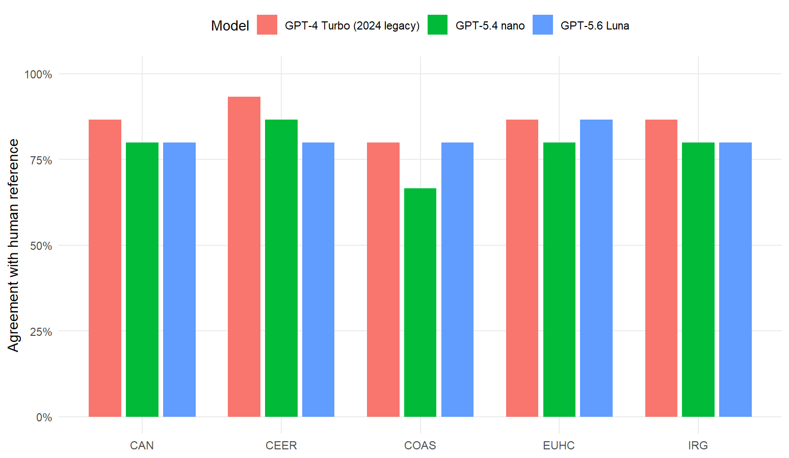
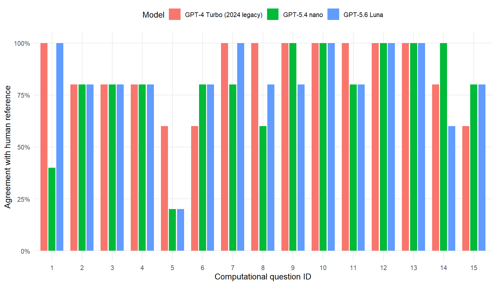

```{r}
#| label: setup
#| include: false
library(dplyr)
library(knitr)
library(readr)
library(tidyr)
library(yaml)

cfg <- yaml::read_yaml("config/config.yml")
legacy_model_id <- cfg$legacy_protocol$model_alias
comparison_models <- purrr::map_dfr(
  cfg$comparison$comparison_models,
  ~ tibble::as_tibble(.x)
) |>
  dplyr::transmute(
    model_id = as.character(.data$model_id),
    model = as.character(.data$label)
  )
expected_model_ids <- c(legacy_model_id, comparison_models$model_id)

paths <- list(
  overall = "derived/sbs_model_metrics_overall.csv",
  by_pon = "derived/sbs_model_metrics_by_pon.csv",
  stability = "derived/sbs_model_stability_overall.csv",
  flips = "derived/sbs_model_flip_audit.csv",
  diagnostics = "derived/sbs_output_format_diagnostics.csv"
)
comparison_ready <- all(file.exists(unlist(paths)))

if (comparison_ready) {
  overall <- readr::read_csv(paths$overall, show_col_types = FALSE)
  by_pon <- readr::read_csv(paths$by_pon, show_col_types = FALSE)
  stability <- readr::read_csv(paths$stability, show_col_types = FALSE)
  flips <- readr::read_csv(paths$flips, show_col_types = FALSE)
  diagnostics <- readr::read_csv(paths$diagnostics, show_col_types = FALSE)

  comparison_ready <- setequal(overall$model_id, expected_model_ids) &&
    all(comparison_models$model_id %in% stability$comparison_model_id) &&
    all(comparison_models$model_id %in% flips$comparison_model_id) &&
    all(comparison_models$model_id %in% diagnostics$model_id)
}

if (comparison_ready) {
  legacy_accuracy <- overall |>
    dplyr::filter(.data$model_id == legacy_model_id) |>
    dplyr::pull(.data$accuracy)

  contemporary_summary <- overall |>
    dplyr::filter(.data$model_id %in% comparison_models$model_id) |>
    dplyr::left_join(comparison_models, by = "model_id", suffix = c("_result", "")) |>
    dplyr::mutate(change_pp = 100 * (.data$accuracy - legacy_accuracy))

  flip_summary <- flips |>
    dplyr::filter(.data$changed) |>
    dplyr::count(.data$comparison_model, .data$comparison_model_id, .data$direction, name = "n")

  flip_totals <- flips |>
    dplyr::group_by(.data$comparison_model, .data$comparison_model_id) |>
    dplyr::summarise(
      changed = sum(.data$changed),
      toward = sum(.data$direction == "Toward human"),
      away = sum(.data$direction == "Away from human"),
      .groups = "drop"
    )

  legacy_by_pon <- by_pon |>
    dplyr::filter(.data$model_id == legacy_model_id) |>
    dplyr::select(.data$pon, legacy_accuracy = .data$accuracy)

  by_pon_display <- by_pon |>
    dplyr::select(.data$pon, .data$model, .data$model_id, .data$accuracy) |>
    dplyr::left_join(legacy_by_pon, by = "pon") |>
    dplyr::mutate(
      change_vs_legacy_pp = dplyr::if_else(
        .data$model_id == legacy_model_id,
        NA_real_,
        100 * (.data$accuracy - .data$legacy_accuracy)
      )
    )
}
```

## Design

This comparison holds the **protocol, five PONs, 15 questions, and human reference fixed** while varying the model arm. The historical GPT-4 Turbo arm is preserved rather than rerun; the two contemporary arms were executed independently under the reconstructed Dec. 24, 2024 SBS protocol.

| Model | Status |
|---|---|
| GPT-4 Turbo | Frozen 2024 `*_sbs.txt` responses; never rerun |
| GPT-5.4 nano (`gpt-5.4-nano-2026-03-17`) | Completed SBS run under `output/current/` |
| GPT-5.6 Luna (`gpt-5.6-luna`) | Completed SBS run under `output/current/` |

: Model sources and run status {#tbl-model-status}

OpenAI's GPT-5.6 Luna model page was checked on **2026-08-31**. Its **Snapshots** section listed `gpt-5.6-luna`, with no dated snapshot identifier analogous to the pinned GPT-5.4 nano snapshot used here. Accordingly, this study treats `gpt-5.6-luna` as an **undated model ID**, not as a dated or immutable snapshot. The configuration records the documentation URL and check date, while each run preserves its UTC execution timestamp plus the requested and API-returned model identifiers in response metadata and the run manifest.

The improved-protocol experiment and plain-zero-shot outputs are archival/secondary and are not pooled into this analysis. The comparison pipeline accepts only run directories containing `run_manifest.json` with `status == "complete"`; failed or incomplete directories are ignored.

```{r}
#| label: no-results
#| results: asis
if (!comparison_ready) {
  cat("::: {.callout-important}\n")
  cat("## Derived comparison files are unavailable or incomplete\n\n")
  cat("The GPT-5.4 nano and GPT-5.6 Luna API runs are already completed and should be reused. Rebuild the derived comparison locally; do **not** rerun an API arm merely because derived files are missing.\n\n")
  cat("```bash\n")
  cat("Rscript scripts/05_compare_scenarios.R\n")
  cat("quarto render\n")
  cat("```\n")
  cat(":::\n")
}
```

## Main result

```{r}
#| label: main-result
#| results: asis
if (comparison_ready) {
  cat(sprintf(
    "Across the 75 PON-question classifications, the frozen GPT-4 Turbo SBS responses agree with the confirmed human reference in **%s** of cases.\n\n",
    scales::percent(legacy_accuracy, accuracy = 0.1)
  ))

  for (i in seq_len(nrow(contemporary_summary))) {
    row <- contemporary_summary[i, ]
    flips_row <- flip_totals |>
      dplyr::filter(.data$comparison_model_id == row$model_id)
    cat(sprintf(
      paste0(
        "**%s** agrees with the human reference in **%s** of cases, a **%+.1f percentage-point** change relative to frozen GPT-4 Turbo. ",
        "It changes **%s of 75 classifications (%s)**: **%s toward** the human reference and **%s away**.\n\n"
      ),
      row$model,
      scales::percent(row$accuracy, accuracy = 0.1),
      row$change_pp,
      flips_row$changed,
      scales::percent(flips_row$changed / 75, accuracy = 0.1),
      flips_row$toward,
      flips_row$away
    ))
  }
}
```

The results are descriptive of this fixed five-PON, 15-question comparison. They do not establish that one model is generally superior across other tasks, prompts, or domains.

## Agreement with the confirmed human reference

```{r}
#| label: tbl-overall
#| tbl-cap: "Overall SBS agreement and reference-based diagnostics"
if (comparison_ready) {
  overall |>
    dplyr::transmute(
      Model = .data$model,
      Decisions = .data$n,
      Agreement = scales::percent(.data$accuracy, accuracy = 0.1),
      Disagreement = scales::percent(.data$disagreement_rate, accuracy = 0.1),
      Precision = scales::percent(.data$precision, accuracy = 0.1),
      Recall = scales::percent(.data$recall, accuracy = 0.1),
      Specificity = scales::percent(.data$specificity, accuracy = 0.1),
      F1 = scales::percent(.data$f1, accuracy = 0.1)
    ) |>
    knitr::kable()
}
```

```{r}
#| label: tbl-by-pon
#| tbl-cap: "Agreement with the confirmed human reference by PON and model"
if (comparison_ready) {
  by_pon_display |>
    dplyr::transmute(
      PON = .data$pon,
      Model = .data$model,
      Agreement = scales::percent(.data$accuracy, accuracy = 0.1),
      `Change vs. GPT-4 Turbo` = dplyr::if_else(
        is.na(.data$change_vs_legacy_pp),
        "—",
        sprintf("%+.1f pp", .data$change_vs_legacy_pp)
      )
    ) |>
    knitr::kable()
}
```

::: {#fig-by-pon}

:::

## Agreement with the human majority

The confirmed human reference is the majority vote of HBM, ASC, and JNG. Accordingly, the **Agreement** values above are each model's agreement rate with that three-human majority. Precision, recall, specificity, and F1 treat the human-majority TRUE/FALSE classification as the reference label; they are reference-based diagnostics, not claims that the human majority is an external ground truth.

```{r}
#| label: tbl-majority
#| tbl-cap: "LLM agreement with the three-human majority across the 15-question computational instrument"
if (comparison_ready) {
  overall |>
    dplyr::transmute(
      Model = .data$model,
      `Agreement with human majority` = scales::percent(.data$accuracy, accuracy = 0.1)
    ) |>
    knitr::kable()
}
```

## Model-generation stability relative to frozen GPT-4 Turbo

```{r}
#| label: tbl-stability
#| tbl-cap: "Agreement between frozen GPT-4 Turbo SBS and each contemporary SBS model"
if (comparison_ready) {
  stability |>
    dplyr::transmute(
      `Contemporary model` = .data$comparison_model,
      Decisions = .data$decisions,
      Same = .data$same,
      Changed = .data$changed,
      `Agreement with GPT-4 Turbo` = scales::percent(.data$agreement_rate, accuracy = 0.1)
    ) |>
    knitr::kable()
}
```

```{r}
#| label: tbl-flips
#| tbl-cap: "Changed classifications and their direction relative to the human reference"
if (comparison_ready) {
  flip_totals |>
    dplyr::transmute(
      Model = .data$comparison_model,
      Changed = .data$changed,
      `Toward human` = .data$toward,
      `Away from human` = .data$away
    ) |>
    knitr::kable()
}
```

::: {#fig-question}

:::

## Run-integrity diagnostics

```{r}
#| label: tbl-diagnostics
#| tbl-cap: "Output-format diagnostics for the completed contemporary-model SBS runs"
if (comparison_ready) {
  diagnostics |>
    knitr::kable()
}
```

The comparison script enforces the expected analytical cardinality before writing results: 75 decisions per model, 15 decisions per model/PON, one row per model/PON/question key, and a common human-reference value for every paired decision. Each contemporary model is compared directly with the frozen GPT-4 Turbo outputs. Historical outputs remain untouched regardless of parsing or scoring results.
