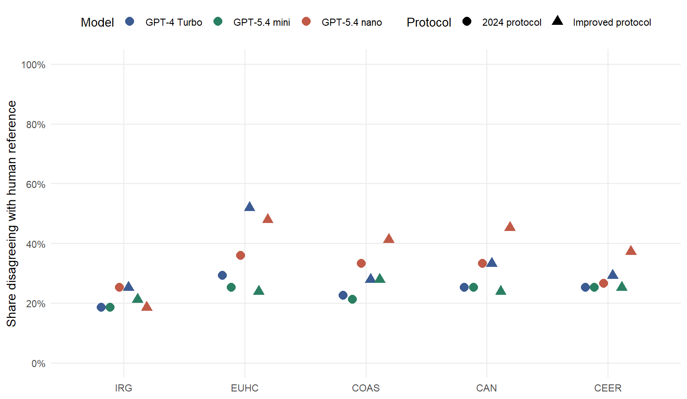
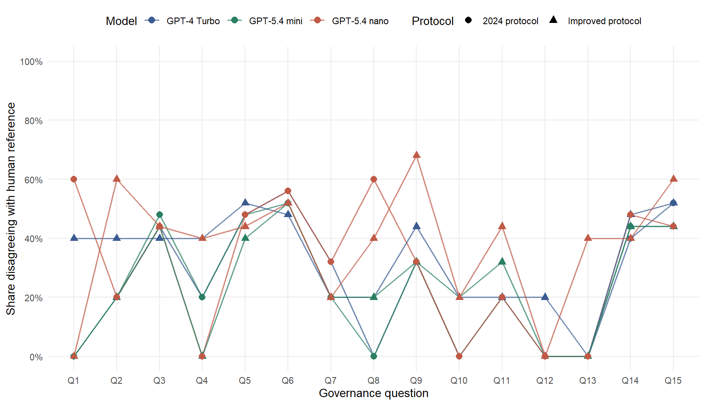

```{r}
#| label: setup
#| include: false
library(dplyr)
library(knitr)
library(readr)

scenario_metrics_path <- "derived/scenario_metrics_by_pon.csv"
scenario_overall_path <- "derived/scenario_metrics_overall.csv"
question_path <- "derived/scenario_question_performance.csv"
prevalence_path <- "derived/scenario_response_prevalence.csv"
protocol_effects_path <- "derived/protocol_effects.csv"
model_effects_path <- "derived/model_effects.csv"
stability_path <- "derived/model_stability_by_pon.csv"
stability_overall_path <- "derived/model_stability_overall.csv"
format_path <- "derived/output_format_diagnostics.csv"

required_paths <- c(
  scenario_metrics_path,
  scenario_overall_path,
  question_path,
  prevalence_path,
  protocol_effects_path,
  model_effects_path,
  stability_path,
  stability_overall_path,
  format_path
)

comparison_ready <- all(file.exists(required_paths))

if (comparison_ready) {
  scenario_metrics <- readr::read_csv(scenario_metrics_path, show_col_types = FALSE)
  scenario_overall <- readr::read_csv(scenario_overall_path, show_col_types = FALSE)
  question_performance <- readr::read_csv(question_path, show_col_types = FALSE)
  response_prevalence <- readr::read_csv(prevalence_path, show_col_types = FALSE)
  protocol_effects <- readr::read_csv(protocol_effects_path, show_col_types = FALSE)
  model_effects <- readr::read_csv(model_effects_path, show_col_types = FALSE)
  stability <- readr::read_csv(stability_path, show_col_types = FALSE)
  stability_overall <- readr::read_csv(stability_overall_path, show_col_types = FALSE)
  format_diagnostics <- readr::read_csv(format_path, show_col_types = FALSE)
}
```

## Design

The analysis is zero-shot only and uses a **3 × 2 model-by-protocol design**: three model arms under the preserved 2024 protocol and the improved protocol. The same five PONs—IRG, EUHC, COAS, CAN, and CEER—and the same 15 questions are evaluated in every cell.

```{r}
#| label: tbl-scenarios
#| tbl-cap: "Six zero-shot scenarios in the model-by-protocol design"

tibble::tribble(
  ~Model, ~Protocol, ~Source,
  "GPT-4 Turbo", "2024 protocol", "Preserved Dec. 24, 2024 output",
  "GPT-5.4 nano", "2024 protocol", "Retained 2026 run",
  "GPT-5.4 mini", "2024 protocol", "New 2026 run",
  "GPT-4 Turbo", "Improved protocol", "New improved-protocol run",
  "GPT-5.4 nano", "Improved protocol", "New improved-protocol run",
  "GPT-5.4 mini", "Improved protocol", "New improved-protocol run"
) |>
  knitr::kable()
```

::: {.callout-note}
The historical calls record the alias `gpt-4-turbo`, not the returned snapshot ID. The improved-protocol rerun uses the pinned `gpt-4-turbo-2024-04-09` snapshot as the closest reproducible counterpart. This improves reproducibility but cannot prove byte-for-byte identity with the model that served the 2024 alias.
:::

## Why the improved protocol is better

The improved prompt is intentionally short. It keeps the same documents, 15 questions, zero-shot design, Chat Completions endpoint, and system/user message roles. The substantive treatment is the instruction text; the improved runs also use the same documented 500-token operational output cap.

- **Evidence boundary:** use only the supplied document.
- **Decision rule:** return TRUE only when the document explicitly supports the proposition; otherwise FALSE.
- **Inference boundary:** do not import outside knowledge or infer unstated rules.
- **Output contract:** return exactly one ordered `question_id,response` row per question.

This makes the coding threshold and serialization contract explicit without adding examples, chain-of-thought instructions, or a structured-output API parameter.

```{r}
#| label: no-results
#| results: asis

if (!comparison_ready) {
  cat("::: {.callout-important}\n")
  cat("## Six-scenario results are not complete yet\n\n")
  cat("Run the improved-protocol stage, rebuild the comparisons, then render:\n\n")
  cat("```bash\n")
  cat("python scripts/04_run_improved_protocol.py\n")
  cat("python scripts/04_run_improved_protocol.py --execute\n")
  cat("Rscript scripts/05_compare_scenarios.R\n")
  cat("quarto render\n")
  cat("```\n")
  cat(":::\n")
}
```

## Performance against the human reference

```{r}
#| label: tbl-overall-performance
#| tbl-cap: "Overall performance against the recovered human reference across six zero-shot scenarios"

if (comparison_ready) {
  scenario_overall |>
    dplyr::mutate(
      accuracy = scales::percent(.data$accuracy, accuracy = 0.1),
      precision = scales::percent(.data$precision, accuracy = 0.1),
      recall = scales::percent(.data$recall, accuracy = 0.1),
      specificity = scales::percent(.data$specificity, accuracy = 0.1),
      f1 = scales::percent(.data$f1, accuracy = 0.1)
    ) |>
    dplyr::select(
      .data$model,
      .data$protocol,
      .data$n,
      .data$accuracy,
      .data$precision,
      .data$recall,
      .data$specificity,
      .data$f1
    ) |>
    knitr::kable(
      col.names = c(
        "Model", "Protocol", "Decisions", "Accuracy",
        "Precision", "Recall", "Specificity", "F1"
      )
    )
}
```

::: {.callout-tip appearance="simple"}
**Question:** Which combinations of model and protocol produce the smallest share of disagreements with the human reference, and are the gains consistent across PONs?
:::

```{r}
#| label: fig-scenario-disagreement
#| fig-cap: "Share of decisions disagreeing with the recovered human reference by PON. Color maps model generation; shape maps protocol. Each point summarizes 15 binary decisions."
#| fig-height: 5
#| results: asis

if (comparison_ready) {
  cat("\n")
}
```

The disagreement rate is shown rather than a raw error count so each point conveys the **relative weight of errors** in the 15-question coding vector.

## Protocol and model effects

```{r}
#| label: tbl-protocol-effects
#| tbl-cap: "Change in human-reference accuracy after replacing the 2024 prompt with the improved protocol"

if (comparison_ready) {
  protocol_effects |>
    dplyr::mutate(
      `2024 protocol` = scales::percent(.data$`2024 protocol`, accuracy = 0.1),
      `Improved protocol` = scales::percent(.data$`Improved protocol`, accuracy = 0.1),
      accuracy_change = scales::percent(.data$accuracy_change, accuracy = 0.1)
    ) |>
    dplyr::select(
      .data$pon,
      .data$model,
      .data$`2024 protocol`,
      .data$`Improved protocol`,
      .data$accuracy_change
    ) |>
    dplyr::arrange(.data$pon, .data$model) |>
    knitr::kable(
      col.names = c(
        "PON", "Model", "2024 protocol", "Improved protocol", "Change"
      )
    )
}
```

```{r}
#| label: tbl-model-effects
#| tbl-cap: "Human-reference accuracy by model within each protocol, with pairwise changes"

if (comparison_ready) {
  model_effects |>
    dplyr::mutate(
      `GPT-4 Turbo` = scales::percent(.data$`GPT-4 Turbo`, accuracy = 0.1),
      `GPT-5.4 nano` = scales::percent(.data$`GPT-5.4 nano`, accuracy = 0.1),
      `GPT-5.4 mini` = scales::percent(.data$`GPT-5.4 mini`, accuracy = 0.1),
      nano_vs_turbo = scales::percent(.data$nano_vs_turbo, accuracy = 0.1),
      mini_vs_turbo = scales::percent(.data$mini_vs_turbo, accuracy = 0.1),
      mini_vs_nano = scales::percent(.data$mini_vs_nano, accuracy = 0.1)
    ) |>
    dplyr::select(
      .data$pon,
      .data$protocol,
      .data$`GPT-4 Turbo`,
      .data$`GPT-5.4 nano`,
      .data$`GPT-5.4 mini`,
      .data$nano_vs_turbo,
      .data$mini_vs_turbo,
      .data$mini_vs_nano
    ) |>
    dplyr::arrange(.data$pon, .data$protocol) |>
    knitr::kable(
      col.names = c(
        "PON", "Protocol", "GPT-4 Turbo", "GPT-5.4 nano", "GPT-5.4 mini",
        "Nano − Turbo", "Mini − Turbo", "Mini − Nano"
      )
    )
}
```

## Question-level behavior

::: {.callout-tip appearance="simple"}
**Question:** Which governance questions remain difficult across models and protocols, and which problems appear to be prompt-sensitive?
:::

```{r}
#| label: fig-question-disagreement
#| fig-cap: "Question-level disagreement with the recovered human reference across the six zero-shot scenarios. Each rate pools the five study PONs."
#| fig-height: 5.5
#| results: asis

if (comparison_ready) {
  cat("\n")
}
```

```{r}
#| label: tbl-response-prevalence
#| tbl-cap: "TRUE-response prevalence across the six zero-shot scenarios"

if (comparison_ready) {
  response_prevalence |>
    dplyr::mutate(
      true_rate = scales::percent(.data$true_rate, accuracy = 0.1)
    ) |>
    dplyr::select(
      .data$model,
      .data$protocol,
      .data$true_responses,
      .data$false_responses,
      .data$true_rate
    ) |>
    knitr::kable(
      col.names = c("Model", "Protocol", "TRUE", "FALSE", "TRUE share")
    )
}
```

A large shift in TRUE prevalence is worth checking because it can indicate that a protocol or model changes the effective evidentiary threshold rather than merely reshuffling isolated classifications.

## Model-generation stability

With three model arms, stability is reported pairwise within each protocol. This shows whether the improved protocol makes model choice less consequential and whether GPT-5.4 mini behaves more like GPT-5.4 nano or GPT-4 Turbo.

```{r}
#| label: tbl-stability-overall
#| tbl-cap: "Pairwise agreement between model arms under each zero-shot protocol"

if (comparison_ready) {
  stability_overall |>
    dplyr::mutate(
      agreement_rate = scales::percent(.data$agreement_rate, accuracy = 0.1)
    ) |>
    dplyr::select(
      .data$protocol,
      .data$model_pair,
      .data$decisions,
      .data$same,
      .data$changed,
      .data$agreement_rate
    ) |>
    knitr::kable(
      col.names = c(
        "Protocol", "Model pair", "Decisions", "Same", "Changed", "Agreement"
      )
    )
}
```

## Run-integrity diagnostics

```{r}
#| label: output-format-callout
#| results: asis

if (comparison_ready) {
  anomalies <- format_diagnostics |>
    dplyr::filter(
      .data$parse_status != "OK" |
        .data$concatenated_row_boundaries > 0 |
        .data$header_contains_binary_token |
        !.data$header_standard
    )

  if (nrow(anomalies) == 0) {
    cat("All newly generated outputs contain exactly 15 recoverable classifications and no flagged formatting irregularities.\n")
  } else {
    cat("::: {.callout-warning}\n")
    cat("## Output-format anomalies detected\n\n")
    cat(sprintf(
      "%s of %s newly generated output files contain a flagged serialization irregularity. A file is scored only when exactly 15 binary responses are recoverable.\n",
      nrow(anomalies),
      nrow(format_diagnostics)
    ))
    cat(":::\n")
  }
}
```

```{r}
#| label: tbl-format-diagnostics
#| tbl-cap: "Newly generated output files with flagged formatting irregularities"

if (comparison_ready) {
  format_diagnostics |>
    dplyr::filter(
      .data$parse_status != "OK" |
        .data$concatenated_row_boundaries > 0 |
        .data$header_contains_binary_token |
        !.data$header_standard
    ) |>
    dplyr::select(
      .data$file,
      .data$recovered_responses,
      .data$concatenated_row_boundaries,
      .data$header_standard,
      .data$first_line
    ) |>
    knitr::kable(
      col.names = c(
        "File", "Recovered", "Concatenated boundaries", "Standard header", "First line"
      )
    )
}
```

## Interpretation boundary

Human-reference disagreement is disagreement with the recovered computational reference, not definitive evidence that a model is substantively wrong. Likewise, higher model-generation agreement is stability, not correctness. The design is most informative when both quantities are examined together.
